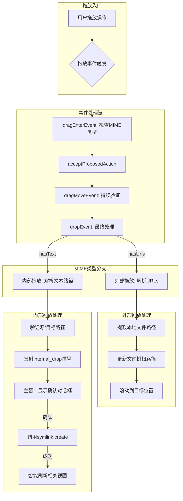

# Symlink-GUI

## 1. 概述

本项目是一个使用 **Python 3** 和 **PyQt6** 的图形用户界面（GUI）应用程序，简化在 Windows 上创建文件和文件夹符号链接（symlink）的过程。

核心功能是双面板视图：

- **内部拖放**：从一个面板(源)拖放到另一个面板(目标)创建符号链接
- **外部拖放**：从文件管理器拖放文件/文件夹到任一面板进行快速导航
- **日志记录**：记录关键操作和错误信息

## 2. 技术栈

- **编程语言**: Python 3
- **GUI 框架**: PyQt6 (包含以下模块)
  - `QtWidgets`: QMainWindow, QSplitter, QTreeView, QMessageBox
  - `QtCore`: QDir, QMimeData, Qt, pyqtSignal, pyqtSlot
  - `QtGui`: QDrag, QFileSystemModel
- **拖放支持**: PyQt6 完整的拖放事件处理链
- **日志模块**: Python 标准库 logging

## 3. 项目文件结构

```shell
mklink-gui/
│
├── main.py              # 程序主入口，初始化 QApplication 和 MainWindow
│
├── core/
│   ├── __init__.py
│   └── symlink.py         # 符号链接核心逻辑，包含权限检查
│
├── ui/
│   ├── __init__.py
│   ├── main_window.py     # 主窗口实现，处理符号链接创建确认
│   └── file_tree.py       # 文件树组件，完整拖放功能实现
│
├── poetry.lock          # Poetry 依赖锁定文件
├── pyproject.toml       # Poetry 项目配置文件
└── requirements.txt     # 传统 requirements 文件
```

## 4. 核心组件设计

### `main.py`

- 职责：
  - 初始化 `QApplication` 实例
  - 创建 `MainWindow` 主窗口
  - 启动应用事件循环 `app.exec()`

### `ui/main_window.py` (MainWindow 类)

- 职责：
  - 构建主界面，使用 `QSplitter` 分割左右面板
  - 每个面板包含一个 `FileTreeView` 实例
  - 处理符号链接创建确认流程
  - 显示操作结果反馈
- 关键实现：
  - 使用 `pyqtSlot` 装饰器处理信号
  - 自动检测管理员权限并更新窗口标题
  - 智能刷新受影响的文件树视图

### `ui/file_tree.py` (FileTreeView 类)

- 职责：完整的文件浏览和拖放功能实现
- **数据模型**:
  - 使用 `QFileSystemModel` 提供文件系统数据
  - 自动过滤系统目录 (NoDotAndDotDot)
  - 支持懒加载和大目录性能优化
- **视图配置**:
  - 隐藏非必要列 (只保留名称和修改日期)
  - 默认按名称升序排序
- **拖放实现**:
  - 完整实现拖放事件链: `dragEnterEvent`, `dragMoveEvent`, `dropEvent`
  - 支持多种 MIME 类型: URLs 和纯文本
  - 精确处理放置位置判断
  - 使用 `pyqtSignal` 通知主窗口内部拖放事件

### `core/symlink.py`

- 职责：
  - 安全创建符号链接 (文件和目录)
  - 全面的错误处理 (权限、路径存在性等)
  - Windows 特有问题处理 (ERROR_PRIVILEGE_NOT_HELD)
  - 管理员权限检测 (`IsUserAnAdmin`)

## 5. 工作流程图 (实现版)



## 6. 其他约定

- **管理员权限**:
  - 启动时自动检测 (`IsUserAnAdmin`)
  - 更新窗口标题提示
  - 捕获 ERROR_PRIVILEGE_NOT_HELD (1314) 错误
- **初始目录**:
  - 文件树初始显示所有驱动器
  - 默认选中系统盘 (通常是C:\)
- **日志记录**:
  - 记录关键操作和错误
  - 使用Python标准库logging模块
